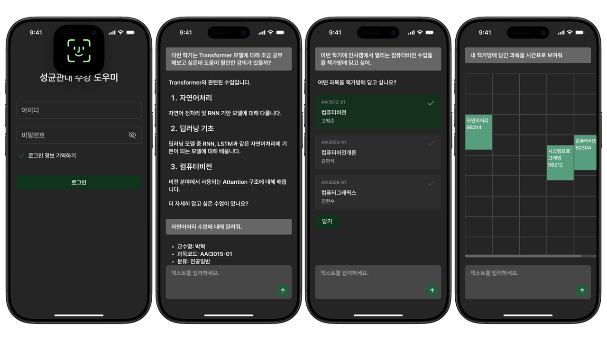

# SWE-2025 팀프로젝트

- `SRS`: [SRS_IEEE.pdf](./assets/SRS_IEEE_template.pdf)
- `Demo`: [demo.mp4](./assets/demo.mp4)
- `Project`: [pyproject.toml](./src/lib/server/pyproject.toml)
- `Docker`: [Dockerfile](./src/lib/server/Dockerfile)

## Prototype



> 이 프로젝트는 Apple Inc.에서 제공하는 Apple Design Resources를 기반으로 한 시각 자료를 포함하고 있습니다. 해당 자료는 Apple Design Resources License(2023년 6월 21일자)의 조건에 따라 교육 목적(학교 과제)으로만 사용되었으며, 사용자 인터페이스 목업 제작 용도로만 활용되었습니다.

## RUN

### Backend

먼저 [.env](src/lib/server/.env)를 수정합니다.

```sh
$ cd src\lib\server               # 서버 파일 경로
$ docker build -t my-app .        # docker 빌드
$ docker run -p 8001:8001 my-app  # docker 실행
```

### Frontend

```sh
$ npm install
$ npm run dev
```
